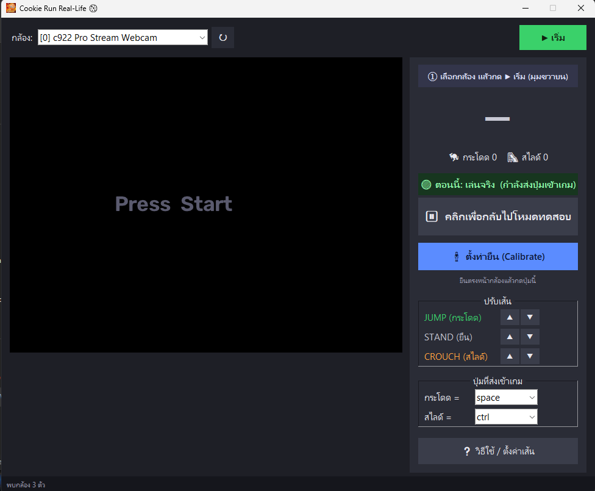

<div align="center">


# Cookie Run Real-Life 🍪

**เล่น Cookie Run ด้วยการกระโดด/ย่อจริงผ่านเว็บแคม**
กระโดดจริง → ตัวละครกระโดด · ย่อตัวจริง → ตัวละครสไลด์

[](../../releases/latest)
[](../../releases/latest)
[](../../releases)
[](LICENSE)
[](https://developers.google.com/mediapipe)

<a href="https://github.com/pondlnwtrue007/cookie-run-reallife/releases/latest/download/Cookie.Run.Real-Life.exe">
  
</a>

<sub>คลิกปุ่มด้านบนเพื่อโหลด `Cookie.Run.Real-Life.exe` ทันที (~187MB)</sub>

<sub>🎨 FAN-MADE · แจกฟรี ห้ามนำไปขาย/หากำไร · ไม่เกี่ยวข้องกับ Devsisters — ดู [LICENSE](LICENSE)</sub>

</div>

---

## 🎬 หน้าตาแอป

<div align="center">

</div>

> เลือกกล้อง → ตั้งท่ายืน → กดปุ่มเขียว **"เล่นจริง"** → กระโดด/ย่อหน้ากล้อง! · มี **แถบไกด์สีฟ้า** บอกทุกขั้น + **ตัวนับ 🦘/🛝** ให้เห็นว่าจับท่าได้จริง

---

## ⬇️ โหลดแล้วเล่นเลย (สำหรับคนทั่วไป)

1. คลิก **[⬇️ ดาวน์โหลด Cookie.Run.Real-Life.exe](https://github.com/pondlnwtrue007/cookie-run-reallife/releases/latest/download/Cookie.Run.Real-Life.exe)** (โหลดไฟล์ทันที ~187MB) — หรือดูทุกเวอร์ชันที่หน้า [Releases](../../releases)
2. **ดับเบิลคลิกไฟล์ที่โหลดมา** → ถ้า Windows เด้ง UAC ให้กด **Yes** (โปรแกรมขอสิทธิ์เพื่อส่งปุ่มเข้าเกม)
   - ถ้า SmartScreen เตือน "Windows protected your PC" → กด **More info → Run anyway**
3. รอ ~15-20 วิ (ครั้งแรกแตกไฟล์) → แอปเปิดขึ้นมา → **ทำตามแถบไกด์สีฟ้าในแอป** ได้เลย:
   `① เลือกกล้อง → ② ตั้งท่ายืน → ③ กดปุ่มเขียว "เล่นจริง"` → คลิกหน้าต่างเกม → กระโดด/ย่อ!

> ต้องมี **MuMuPlayer + เกม Cookie Run** เปิดไว้ และตั้ง keymapping (Space=กระโดด, Ctrl=สไลด์) — ดูหัวข้อ "ตั้งค่า MuMuPlayer" ด้านล่าง
> 💻 ต้องใช้ **Windows** + **เว็บแคม** · บางเครื่องที่เปิด Smart App Control อาจเตือน/บล็อก .exe — ถ้าเปิดไม่ได้ให้รันผ่านซอร์สโค้ดแทน (ดูด้านล่าง)

---

# 🖥️ วิธีที่ 1: แอป GUI (แนะนำ)

แอปหน้าต่างเดียวจบ — เลือกกล้องเอง, ปรับเส้นด้วยเมาส์, มีวิธีใช้ในตัว

### เปิดจากไฟล์ .exe (สำหรับแจกเพื่อน — ไม่ต้องลง Python)
ดับเบิลคลิก **`Cookie Run Real-Life.exe`** → ถ้า UAC เด้ง กด **Yes** (แอปขอสิทธิ์ admin เพื่อส่งปุ่มเข้าเกม)
> ครั้งแรกอาจเปิดช้า ~15-20 วิ (แตกไฟล์ AI ในตัว) ครั้งต่อไปเร็วขึ้น

> ⚠️ **ถ้า Windows เตือน/บล็อกไฟล์** (SmartScreen หรือ Smart App Control)
> เพราะ .exe ยังไม่ได้เซ็นชื่อดิจิทัล (ปกติของโปรแกรมทำเอง):
> - **SmartScreen เตือน** ("Windows protected your PC") → กด **More info → Run anyway**
> - **Smart App Control** บางเครื่อง (Windows 11) อาจ **เตือนหรือบล็อก** — ถ้าเปิดไม่ได้จริงๆ ให้รันผ่าน Python แทน (ดับเบิลคลิก **`เล่น Cookie Run.bat`**) หรือปิด Smart App Control ที่ Settings → Privacy & security → Windows Security → App & browser control → Smart App Control → **Off**

### หรือเปิดด้วย Python (แนะนำสำหรับเครื่องคุณเอง)
ครั้งแรก ติดตั้ง dependencies:
```powershell
cd "W:\Cookie run Reallife"
py -m pip install -r requirements.txt
```
จากนั้นแค่ **ดับเบิลคลิก `เล่น Cookie Run.bat`** (หรือสั่ง `py app.py`)
> วิธีนี้เปิดได้แม้เครื่องเปิด Smart App Control อยู่ (เพราะ Python เชื่อถือได้)

### ใช้งานในแอป (มี **แถบไกด์สีฟ้า** บอกขั้นตอนถัดไปในตัว)
1. **เลือกกล้อง** จาก dropdown (เลือก**กล้องจริง**ของคุณ ไม่ใช่กล้องเสมือนอย่าง OBS Virtual Camera) แล้วกด **▶ เริ่ม**
2. ยืนตรงหน้ากล้อง กด **🧍 ตั้งท่ายืน (Calibrate)** — ยืนนิ่ง 2 วิ
3. ลองกระโดด/ย่อ ดูตัวนับ **🦘 กระโดด / 🛝 สไลด์** ถ้าเลขเพิ่ม = จับท่าได้ (ปรับความไวด้วยปุ่ม **▲▼** ที่เส้น JUMP/CROUCH)
4. ตั้งค่า MuMu ให้ตรง (ดูด้านล่าง) → กดปุ่มเขียว **"▶ คลิกตรงนี้เพื่อเล่นจริง"** (ป้ายบนเปลี่ยนเป็น 🟢 เล่นจริง)
5. คลิกหน้าต่างเกม (MuMu) แล้วกระโดด/ย่อได้เลย!

แอปจะ **จำค่าที่ตั้งไว้** (กล้อง/ปุ่ม/เส้น) ให้อัตโนมัติ · ต้องเปิดแบบ **Run as administrator** (`.exe`/`.bat` ขอให้เอง) ปุ่มถึงเข้าเกม

### 🕊️ ท่าพิเศษ: บิน (ตอน Bonus Time)
ช่วง Bonus Time ที่ต้อง "กดกระโดดค้างเพื่อบิน" — เล่นด้วยท่าจริงได้:
- **กางแขนสองข้าง (ท่า T) + กระพือปีกขึ้น-ลง + เด้งตัวไปด้วยเรื่อยๆ** = บินขึ้น (กด space ค้าง)
- **หยุดขยับ** = ปล่อย = ร่วงลง  (ต้องขยับต่อเนื่องถึงจะบินอยู่)
- ป้ายจะขึ้น **FLY** (สีฟ้า) + ตัวนับ **🕊️** เพิ่ม · ปรับความไว/เวลาค้างได้ที่กล่อง **"โหมดบิน"**
- ใช้ปุ่มกระโดดเดิม (space) ไม่ต้องตั้ง keymap เพิ่ม

---

## ตั้งค่า MuMuPlayer (ทำครั้งเดียว)

1. เปิด Cookie Run ใน MuMuPlayer
2. เปิดเมนู **keyboard / keymapping** (ไอคอนคีย์บอร์ดที่แถบด้านข้าง)
3. เพิ่มปุ่ม 2 อัน (ให้ตรงกับที่ตั้งในแอป — ค่าเริ่มต้น):
   - **Tap** วางตรงโซนที่แตะเพื่อกระโดดในเกม → ผูกกับปุ่ม **Space**
   - **Swipe/สไลด์ลง** วางตรงโซนสไลด์ → ผูกกับปุ่ม **Ctrl**
     เปิดออปชัน "กดค้าง/ต่อเนื่อง" ถ้ามี เพื่อให้สไลด์ค้างได้
4. บันทึก
> เปลี่ยนปุ่มได้ในแอป (dropdown "ปุ่มที่ส่งเข้าเกม") ให้ตรงกับ MuMu

---

# ⌨️ วิธีที่ 2: โหมด CLI (สำหรับ advanced)

รันในหน้าต่าง OpenCV ล้วนๆ ปรับด้วยคีย์บอร์ด (แก้ค่าใน `config.py`)

```powershell
py main.py
```

- ตอนเปิดจะ **calibrate** อัตโนมัติ → ยืนนิ่งๆ ตรงหน้ากล้อง ~2 วินาที
- ลองกระโดด/ย่อ ดูป้ายมุมขวาเปลี่ยนเป็น **JUMP** / **CROUCH**
- ปรับความไวด้วยปุ่ม `[` (ไวขึ้น) และ `]` (ไวน้อยลง) จนแม่นใจ
- ตำแหน่งกล้อง: ให้เห็นตั้งแต่ **หัวถึงอย่างน้อยสะโพก** และมีที่ว่างให้กระโดดปลอดภัย

**เล่นจริง (CLI):** กด `T` สลับเป็นโหมด LIVE → คลิกหน้าต่าง MuMu → กระโดด/ย่อจริง
> ⚠️ ต้องเปิด cmd/PowerShell แบบ **Run as administrator** ปุ่มถึงจะเข้า MuMu · และปุ่มเข้าเกมเฉพาะตอนหน้าต่าง MuMu focus อยู่

### ⌨️ ปุ่มลัด — เฉพาะโหมด CLI (`main.py`) เท่านั้น

> 🖱️ **แอป GUI ไม่ได้ใช้ปุ่มลัดพวกนี้** — ในแอปปรับเส้นด้วยปุ่ม **▲▼** (เมาส์), Calibrate/สลับโหมด ด้วยปุ่มในหน้าต่างแอป

| ปุ่ม | หน้าที่ |
|------|--------|
| `C` | calibrate (ตั้งท่ายืน) ใหม่ |
| `T` | สลับ ทดสอบ ↔ เล่นจริง (ส่งปุ่ม) |
| `[` / `]` | ปรับความไวทั้ง jump + crouch พร้อมกัน |
| `Q` / `ESC` | ออก |

ปรับเส้นทีละเส้น (จับคู่แนวตั้ง — บน = เลื่อนขึ้น, ล่าง = เลื่อนลง):

| เส้น | ขึ้น | ลง |
|------|:---:|:---:|
| **JUMP** (เขียว) | `u` | `j` |
| **STAND** (เทา) | `i` | `k` |
| **CROUCH** (ส้ม) | `o` | `l` |

> เอาเส้น JUMP เข้าใกล้ STAND = กระโดดเบาๆ ก็ติด · เส้น CROUCH เข้าใกล้ STAND = ย่อนิดเดียวก็สไลด์

## ปรับแต่งเพิ่มใน `config.py` (เฉพาะโหมด CLI)

> แอป GUI ไม่ได้ใช้ `config.py` — แอปจำค่าของตัวเองใน `settings.json` (ปรับผ่านหน้าต่างแอปได้เลย)

| ค่า | ความหมาย |
|-----|---------|
| `CAMERA_INDEX` | เปลี่ยนถ้ามีหลายกล้อง (0,1,2,…) |
| `CAMERA_BACKEND` | `"DSHOW"` (เสถียร แนะนำ) หรือ `"MSMF"` — ถ้าเปิดไม่ติดจะ fallback ให้อัตโนมัติ |
| `USE_MJPG` | ใช้ MJPG เพื่อได้ 30fps (ปิดแล้วจะเหลือ ~15fps) |
| `JUMP_THRESHOLD` / `CROUCH_THRESHOLD` | ต้องขยับมาก/น้อยแค่ไหนถึงนับ (มาก=ไวน้อยลง) |
| `JUMP_DEBOUNCE_SEC` | กันกระโดดครั้งเดียวยิงซ้ำ |
| `RELEASE_MARGIN` | กันสถานะสไลด์กระพริบ |
| `DRY_RUN` | `True` = ทดสอบไม่ส่งปุ่ม, `False` = ส่งจริง |

## แก้ปัญหาเบื้องต้น

- **เปิดกล้องไม่ได้ / หน้าต่างไม่ขึ้น** → ปิดโปรแกรมอื่นที่ใช้กล้อง (Zoom/Teams/OBS/เบราว์เซอร์), อย่าเปิดแอปซ้อนหลายหน้าต่าง (กล้องเปิดได้ทีละโปรแกรม), หรือลองเลือกกล้องอื่น
- **ค้างตอนเปิด (หน้าต่างไม่ขึ้นเลย)** → ตั้ง `CAMERA_BACKEND="DSHOW"` (ค่า default) — MSMF+MJPG ค้างบางเครื่อง
- **กระโดด/ย่อไม่ติด** (ตัวเลข 🦘/🛝 ไม่เพิ่ม) → กด **ตั้งท่ายืน** ใหม่, ปรับเส้นด้วย **▲▼**, ถอยห่างให้กล้องเห็นตัวมากขึ้น (CLI: กด `C` / `[` `]`)
- **ปุ่มไม่เข้าเกม** (ตัวเลขเพิ่มแต่ตัวละครไม่ขยับ) → เช็ค 3 อย่าง:
  1. เปิดแอปแบบ **Run as administrator** (MuMu รันสิทธิ์สูง — ไม่งั้นปุ่มถูกบล็อก) · ตัว .exe/`.bat` ขอ admin ให้เอง
  2. อยู่โหมด **เล่นจริง** (ปุ่มเขียว / CLI กด `T`)
  3. หน้าต่าง MuMu ต้อง **focus** + keymapping ใน MuMu ตรงกับปุ่มในแอป (Space/Ctrl)
- **double jump ในเกม** → กระโดดจริง 2 ครั้ง (เว้นจังหวะนิดนึง อย่ารัวติดกันเกินไป — มีดีเลย์กันกดซ้ำ ~0.35 วิ)
- **หน่วง/ช้า** → ตรวจว่า `CAMERA_BACKEND="DSHOW"` และ `USE_MJPG=True` (ควรได้ ~30fps ขึ้นไป); ถ้ายังช้าลอง `CAMERA_INDEX` อื่น หรือลด `CAMERA_WIDTH/HEIGHT`
- **FPS ที่มุมจอสูงมาก (เช่น 90+)** เป็นเรื่องปกติ — กล้องแยก thread ทำให้ loop วิ่งเร็วกว่าเฟรมกล้องจริง (30fps) เพื่อลด latency

---

## 🛠️ วิธี build เป็น .exe เอง

```powershell
py -m pip install "pyinstaller>=6.20"
py -m PyInstaller CookieRunReallife.spec
```
ได้ไฟล์ที่ **`dist/Cookie Run Real-Life.exe`** (ไฟล์เดียว แจกได้เลย)

> ⚠️ ต้องใช้ **PyInstaller >= 6.20** (เวอร์ชันเก่าแพ็ก numpy 2.x ไม่ครบ → exe เปิดไม่ได้ "numpy C-extensions failed")

ธงใน `CookieRunReallife.spec`:
- `CONSOLE = True` → เห็น log ตอน debug (แจกจริงใช้ False)
- `UAC_ADMIN = False` → ปิดการขอ admin ชั่วคราว เพื่อทดสอบ `--selftest` (แจกจริงใช้ True)
- ทดสอบตัว exe แบบไม่เปิดหน้าต่าง (ตั้ง UAC_ADMIN=False ก่อน): `"dist\Cookie Run Real-Life.exe" --selftest`

---

## 📜 เงื่อนไขการใช้งาน

โปรเจกต์นี้เป็น **FAN-MADE** ทำเองเพื่อความสนุกและการเรียนรู้
- ✅ ใช้ฟรี · แชร์ต่อ · แก้ไข · เรียนรู้จากโค้ดได้
- ❌ **ห้ามนำไปขาย เก็บเงิน หรือแสวงหากำไรทุกรูปแบบ**
- ❌ ห้ามอ้างเป็นผลงานตัวเอง หรือเป็นของทางการ

"Cookie Run" เป็นเครื่องหมายการค้า/ลิขสิทธิ์ของ **Devsisters Corp.** โปรเจกต์นี้ไม่มีส่วนเกี่ยวข้อง ไม่ได้รับการรับรอง และไม่ได้สังกัด Devsisters · โลโก้/รูปตัวละครใช้เพื่ออ้างอิงแบบแฟนเมดเท่านั้น · โปรแกรมให้มาแบบ AS-IS ไม่รับประกันความเสียหาย

รายละเอียดเต็มดูที่ไฟล์ [LICENSE](LICENSE)
